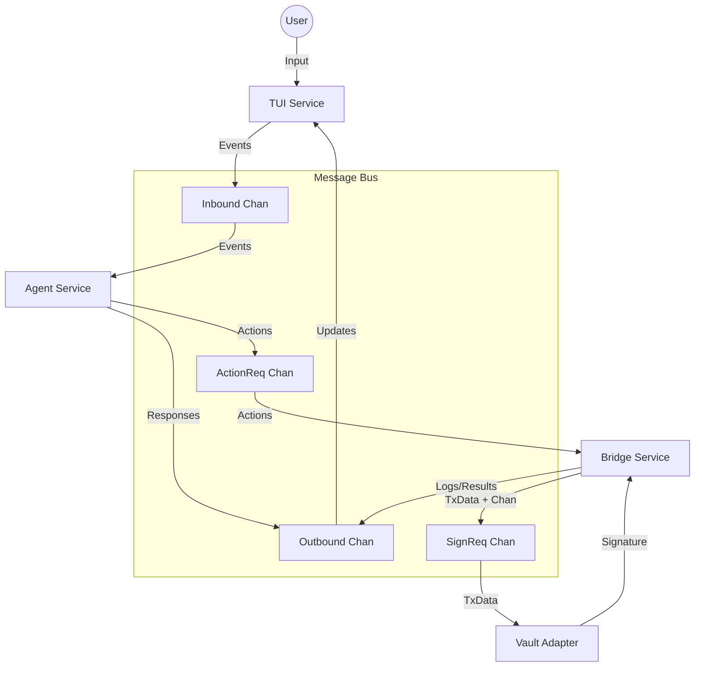

# Concurrency and Data Flow

This document outlines how LucciBot manages concurrency using Goroutines and Channels, and traces the path of data through the system.

---

## 1. Concurrency Model

LucciBot uses a **Shared-Nothing** concurrency model where services communicate strictly via channels managed by the `Hub`. The application lifecycle is orchestrated in `cmd/root.go` using `errgroup`.

### The Main Orchestrator (`cmd/root.go`)
The `main` function (via `rootCmd`) sets up an `errgroup.Group` to manage the lifecycle of long-running services. If any critical service fails or the context is canceled, the group tears down the entire application.

#### Active Goroutines

1.  **Main Thread (TUI)**: The Bubble Tea program (`p.Run()`) takes over the main thread to render the UI. It blocks until the user quits.
2.  **Agent Loop**: A dedicated goroutine running `Agent.Start(ctx)`. It loops forever, `select`ing on `Hub.Inbound`.
3.  **Bridge Loop**: Started via `Bridge.Start(ctx)`, this internal goroutine loops forever, listening to `Hub.ActionReq`.
4.  **Vault Adapter Loop**: Defined inline in `root.go`. It listens to `Hub.SignReq`, performs the blocking `SignTransaction` call, and responds.

### Ad-Hoc Goroutines

*   **TUI Input**: When a user presses Enter, the TUI spawns a short-lived goroutine to push the message to `Hub.Inbound` to avoid blocking the UI render loop.
*   **Bridge Waiter**: When the Bridge requests a signature, it spawns a goroutine to wait for the response on a dedicated, one-time `chan SignResponse`. This prevents the Bridge from blocking other incoming actions while waiting for the Vault.

---

## 2. Data Flow Scenarios

### Scenario A: User sends a chat message
*Flow: TUI -> Agent -> TUI*

1.  **User**: Types "Hello" and presses Enter.
2.  **TUI**: Sends `Event{Type: "user_message", Payload: "Hello"}` to `Hub.Inbound`.
3.  **Agent**: Receives the event.
4.  **Agent**: Determines "Hello" is not a command.
5.  **Agent**: Sends `Event{Type: "response", Payload: "Hello!..."}` to `Hub.Outbound`.
6.  **TUI**: Receives the event via `waitForActivity` and renders the bot's response.

### Scenario B: User requests a Swap (Transaction)
*Flow: TUI -> Agent -> Bridge -> Vault -> Bridge -> TUI*

1.  **User**: Types "swap 1 eth".
2.  **TUI**: Sends message to `Hub.Inbound`.
3.  **Agent**: Parses message, identifies intent "swap".
4.  **Agent**: Sends `Action{SkillName: "swap", Args: ["1", "eth"]}` to `Hub.ActionReq`.
5.  **Bridge**: Receives action. Spawns `bun run skills/swap.ts 1 eth`.
6.  **Bridge**: Captures output (TxData). Creates a temporary `ResponseChan`.
7.  **Bridge**: Sends `SignRequest{TxData: ..., ResponseChan: ...}` to `Hub.SignReq`.
8.  **Vault Adapter**: Receives request. Calls `vault.SignTransaction()`.
9.  **Vault Adapter**: Sends `SignResponse` back on the `ResponseChan`.
10. **Bridge (Waiter)**: Receives signature.
11. **Bridge**: Sends `Event{Type: "TX_SIGNED", ...}` to `Hub.Outbound`.
12. **TUI**: Receives event and displays "Transaction Signed Successfully!".

---

## 3. Channel Architecture Diagram

